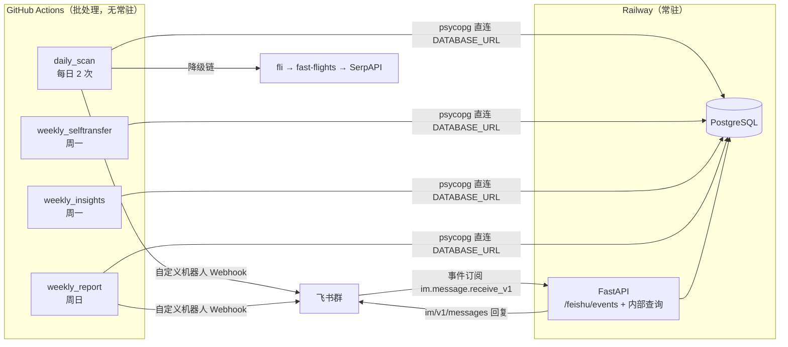

# FareRadar 技术开发文档（Tech Spec）v1.0

| 项 | 内容 |
|---|---|
| 版本 | v1.0 |
| 日期 | 2026-07-06 |
| 目标读者 | Claude Code（按 §2 任务序列执行，可一次性完成开发） |
| 上游文档 | 《FareRadar-产品需求文档-PRD-v1.0》（FR/NFR/UAT 编号均引用该文档） |
| 与 PRD 的偏差 | 4 项，见 §1.3，以本文档为准 |

---

## 1. 总体设计

### 1.1 运行时拓扑

系统一个代码仓库、两个运行位置、一个共享数据库：



要点：批处理任务（采价、基线、信号、周报）全部跑在 GitHub Actions，通过 Railway Postgres 的公网连接串写库并直接推飞书；Railway 上的 FastAPI 只做两件事——接收飞书事件（指令）和读库应答。两侧共享同一套代码（`app/` 包），互不依赖对方在线。

### 1.2 技术栈与版本

| 层 | 选型 | 说明 |
|---|---|---|
| 语言 | Python 3.12 | `.python-version` 固定 |
| Web | FastAPI + uvicorn | 仅事件与查询，无前端 |
| DB 访问 | psycopg 3（sync + 连接池） | 不用 ORM、不用 Alembic；schema.sql 幂等建表 |
| 数据源 | fli（PyPI 包名 `flights`）主力；fast-flights 备用；SerpAPI 兜底 | fli 直接调用 Google Flights 内部 API，MIT 协议，支持 currency/country 参数（README 已核验） |
| HTTP | httpx | 飞书与 SerpAPI 调用 |
| 配置 | PyYAML + 环境变量 | 全部阈值配置化（NFR-06） |
| 测试 | pytest（离线纯逻辑）+ 冒烟脚本（联网手动） | CI 不联网 |
| 部署 | GitHub Actions（cron）+ Railway（web + Postgres） | 无 Docker、无 Redis、无消息队列 |

### 1.3 与 PRD 的偏差（以本文档为准）

| # | 偏差 | 理由 |
|---|---|---|
| D1 | 移除 Cloudflare Worker，飞书事件订阅直连 Railway FastAPI `/feishu/events` | ibkr-bot 需要 Worker 是因为 GitHub Actions 无法接收 webhook；本项目已有常驻 API，少一个部署面 |
| D2 | `baseline` 表增加 `p15` 列 | PRD 告警阈值为 P15，直接物化，避免读时插值 |
| D3 | `price_snapshot` 增加 `variant` 列（邻近机场影子扫描）；新增 `provider_usage` / `route_mute` / `ops_log` 三张实现表 | 影子扫描与预算、静音、可观测的落地需要 |
| D4 | 信号卡的"已购 / 静音"按钮降级为卡片底部指令提示文本 | 自定义机器人卡片按钮仅支持 URL 跳转、无回调；改用 app 机器人推送可恢复按钮，列为可选优化，不进 v1.0 |

---

## 2. 给 Claude Code 的执行指令

### 2.1 硬约束（违反任何一条即为实现错误）

1. 按 §2.2 任务序列 T0→T8 顺序开发；每个任务的 DoD 通过后才进入下一个。
2. 不引入本文档未列出的依赖或服务（不加 ORM、Redis、Celery、Docker、前端框架）。
3. §6.1 的 Provider 契约（`app/providers/base.py`）一经建立不可修改；第三方库 API 与本文档参考代码的任何差异，只允许在对应 provider 文件内部消化。
4. 所有阈值、上限、桶边界只能从 `config/config.yaml` 读取，禁止散落硬编码；常量语义见附录 A。
5. `currency != 'SGD'` 的快照可以入库，但禁止进入基线统计与阈值比较（只允许在详情展示时带币种标注）。
6. pytest 测试全部离线（不发网络请求）；联网验证只存在于 `scripts/smoke_providers.py`，手动运行。
7. 密钥只经环境变量进入；`.env` 在 `.gitignore` 中；任何密钥出现在代码或配置文件中即为错误。
8. 不实现 PRD §4.2 排除项（预订、价格预测、弃程等）；`signals/rules/` 中为禁用规则保留接口即可（FR-SIG-06）。

### 2.2 任务序列

| 任务 | 范围 | DoD（完成定义） | 对应 FR/UAT |
|---|---|---|---|
| T0 环境与第三方核验 | `pip install -r requirements.txt`；核验 `from fli.search import SearchFlights` 与 `import fast_flights` 可导入；阅读已安装 fli 包源码与仓库 `examples/python/date_range_search.py`，确认日期区间搜索的类名与字段（预期 `SearchDates` + `DateSearchFilters`，以实际源码为准）；将核验结论写入 `app/providers/VERIFIED.md`；`pip freeze` 固定 fli / fast-flights 版本号回填 requirements.txt | VERIFIED.md 存在且含两库的导入路径、日期搜索类签名、currency 参数位置 | — |
| T1 骨架与数据库 | 建 §3 仓库结构；`db/schema.sql`（§5.1 全文照抄）；`scripts/bootstrap_db.py`（应用 schema + 从 routes.yaml upsert route 表）；`app/settings.py`（env + yaml 加载）；三个配置文件（§4 全文照抄） | `python scripts/bootstrap_db.py` 连续执行两次均成功；route 表 8 行与 routes.yaml 一致 | FR-BAS-01 前置 |
| T2 数据源适配层 | §6 全部：契约、三个 provider、预算管理、降级链；`scripts/smoke_providers.py` | 冒烟脚本对 R1 真实返回 ≥30 个日历点并打印前 5 条详情；`provider_usage` 计数正确递增；人为改错 fli 导入名可观察到降级到 fast-flights | FR-ING-03/04，UAT-03 前置 |
| T3 采价编排 | `app/jobs/daily_scan.py` 的采集段（§7）：日历扫（含影子航线）+ 钻取 + 入库 | 单次运行后 `price_snapshot` 含全部 enabled 航线（含 HKG 影子）的日历行，R1 ≥ 60 行 | FR-ING-01/02，UAT-01 |
| T4 基线引擎 | §8：重算 SQL、冷启动合并、`resolve_baseline()` 纯函数 | 基线表出现 self 行；`pytest tests/test_baseline.py` 通过 | FR-BAS-02 |
| T5 L1 信号与告警 | §9.2/9.6/9.7 + §10 全部：breach 规则、风险标签、去重、周上限、卡片构建与推送 | 设置 `TEST_FORCE_BREACH=1` 环境变量运行 daily_scan，飞书收到真实卡片且证据链可反查；立即重跑第二次因 dedup 无新推送 | FR-SIG-01/05、RSK-02/03、NTF-01/02/05；UAT-02/04/06 |
| T6 API 与指令 | §11 全部：FastAPI、飞书事件握手、五条指令 | 本地 `uvicorn` 起服后，用 §13.3 的三条 curl 分别通过 url_verification、`/fare` 指令、`/status` 指令 | FR-NTF-03、OPS-02；UAT-05/09 |
| T7 L2 规则与周任务 | §9.3/9.4/9.5 + `weekly_selftransfer.py`、`weekly_insights.py` | `pytest tests/` 全绿；自转衔接 <240min 的用例被拒绝 | FR-SIG-02/03/04、ING-05；UAT-07 |
| T8 工作流与收尾 | §12 两个 workflow、`weekly_report.py`、README、附录 B 自检清单逐项核对 | `pytest` 全绿；两个 yml 通过 `workflow_dispatch` 手动触发成功；附录 B 全勾 | FR-NTF-04、OPS-01；UAT-08/10 |

### 2.3 第三方库差异处理规则

fli 与 fast-flights 是逆向库，字段可能随上游演进。处理规则：参考实现（§6.2/6.3/6.4）表达的是**期望语义**；若实际 API 不同，在 provider 文件内适配并在 `VERIFIED.md` 记录差异，**不改契约、不改上层**。若某库彻底不可用（导入失败 / 全部请求失败），provider 构造时抛 `ProviderUnavailable`，降级链自动跳过——开发不因此中断。

---

## 3. 仓库结构

```text
fareradar/
├── README.md                     # 快速开始 + 部署手册（§14 内容）
├── requirements.txt
├── .python-version               # 3.12
├── .gitignore                    # .env, __pycache__/, .pytest_cache/, *.pyc
├── .env.example
├── Procfile                      # web: uvicorn app.api.server:app --host 0.0.0.0 --port $PORT
├── config/
│   ├── config.yaml               # §4.1
│   ├── routes.yaml               # §4.2
│   └── baggage_fees.yaml         # §4.3
├── db/
│   └── schema.sql                # §5.1
├── app/
│   ├── __init__.py
│   ├── settings.py               # 环境变量 + yaml 单例加载
│   ├── db.py                     # psycopg 连接池、query/execute 辅助
│   ├── providers/
│   │   ├── __init__.py
│   │   ├── VERIFIED.md           # T0 产物
│   │   ├── base.py               # §6.1 契约（冻结）
│   │   ├── fli_provider.py       # §6.2
│   │   ├── fastflights_provider.py  # §6.3
│   │   ├── serpapi_provider.py   # §6.4
│   │   └── chain.py              # §6.5 预算 + 降级链
│   ├── ingestion/
│   │   └── scanner.py            # §7 采价编排
│   ├── baseline/
│   │   └── engine.py             # §8
│   ├── signals/
│   │   ├── engine.py             # 规则注册表 + 执行器
│   │   ├── risk.py               # §9.6
│   │   ├── alerts.py             # §9.7 去重/周上限/落库
│   │   └── rules/
│   │       ├── baseline_breach.py
│   │       ├── date_shift.py
│   │       ├── nearby_airport.py
│   │       ├── self_transfer.py
│   │       └── disabled.py       # HiddenCity/CurrencyArb/OpenJaw 占位（FR-SIG-06）
│   ├── notify/
│   │   ├── feishu.py             # §10.3 webhook 推送 + app 回复
│   │   └── cards.py              # §10.1 卡片构建 + 字段校验
│   ├── api/
│   │   ├── server.py             # §11 FastAPI 入口
│   │   └── commands.py           # 五条指令实现
│   └── jobs/
│       ├── daily_scan.py         # 采集→基线→信号→告警 主编排
│       ├── weekly_selftransfer.py
│       ├── weekly_insights.py
│       └── weekly_report.py
├── scripts/
│   ├── bootstrap_db.py
│   └── smoke_providers.py        # 联网冒烟，手动运行
├── tests/
│   ├── conftest.py               # 纯逻辑 fixture，不连库不联网
│   ├── test_baseline.py
│   ├── test_rules.py
│   ├── test_alerts.py
│   └── test_risk_and_cards.py
└── .github/workflows/
    ├── scan.yml                  # §12.1
    └── weekly.yml                # §12.2
```

requirements.txt 初始内容（T0 结束时回填精确版本）：

```text
fastapi==0.115.6
uvicorn[standard]==0.32.1
psycopg[binary,pool]==3.2.3
httpx==0.27.2
PyYAML==6.0.2
python-dateutil==2.9.0.post0
flights          # fli：Google Flights 逆向库，import fli；T0 后固定版本
fast-flights     # 备用数据源，import fast_flights；T0 后固定版本
pytest==8.3.4
```

---

## 4. 配置与密钥

### 4.1 config/config.yaml（全文）

```yaml
currency: SGD
timezone: Asia/Singapore
cabin: ECONOMY            # 对应 fli SeatType
pax: 1

scan:
  horizon_days: 60        # 日历扫覆盖天数
  drill_top_n: 3          # 每航线每次运行最多钻取的候选日期数
  drill_trigger: p25      # 日历价低于该分位才钻取

baseline:
  window_days: 400        # 统计窗口
  min_sample: 30          # 自建基线可信样本数
  lead_buckets:           # 出发日 - 采价日
    L0: [0, 13]
    L1: [14, 56]
    L2: [57, 9999]

alerts:
  threshold_percentile: p15     # 自建基线触发阈值
  coldstart_factor: 0.95        # 冷启动：p25(=range_low) * factor
  weekly_cap: 5
  dedup_ttl_hours: 72
  price_bucket_sgd: 10          # dedup_key 价格取整粒度

rules:
  date_shift:   { min_pct: 0.15, min_abs: 50 }
  nearby:       { min_pct: 0.12, min_abs: 60, adder_sgd: 40 }
  self_transfer:
    min_pct: 0.12
    min_abs: 150
    hubs: [TPE, NRT, ICN, HKG]
    min_connect_min: 240
    insurance_sgd: 50
    candidate_dates: 3          # 每航线每周取最便宜的 N 个日期尝试
    max_queries: 60             # 该任务单次运行的详情查询上限

providers:
  daily_budget: { fli: 100, fast_flights: 100, serpapi: 10 }
  serpapi_monthly_cap: 200
  fail_threshold: 3             # 连续失败 N 次切下一级

feishu:
  weekly_report_hour_sgt: 20
```

### 4.2 config/routes.yaml（全文）

```yaml
routes:
  - { id: R1, origin: SIN, dest: WUH, trip_type: one_way,   tier: P0, enabled: true }
  - { id: R2, origin: WUH, dest: SIN, trip_type: one_way,   tier: P0, enabled: true }
  - { id: R3, origin: SIN, dest: HKG, trip_type: one_way,   tier: P0, enabled: true,
      nearby_airports: [SZX, CAN] }
  - { id: R4, origin: HKG, dest: SIN, trip_type: one_way,   tier: P0, enabled: true,
      nearby_airports: [SZX, CAN] }
  - { id: R5, origin: SIN, dest: LAX, trip_type: round_trip, tier: P1, enabled: true,
      stay_min: 7, stay_max: 14, stay_rep: 10 }
  - { id: R6, origin: WUH, dest: HKG, trip_type: one_way,   tier: P1, enabled: true,
      nearby_airports: [SZX, CAN] }
  - { id: R7, origin: HKG, dest: WUH, trip_type: one_way,   tier: P1, enabled: true,
      nearby_airports: [SZX, CAN] }
  - { id: R8, origin: WUH, dest: LAX, trip_type: round_trip, tier: P2, enabled: true,
      stay_min: 7, stay_max: 14, stay_rep: 10 }
```

说明：`nearby_airports` 表示对该航线的 **HKG 一端** 做机场替换的影子扫描（R3/R4/R6/R7 中 HKG 分别处于 dest 或 origin，替换对应端）。

### 4.3 config/baggage_fees.yaml（全文）

LCC 折算总价用（FR-RSK-03）。承运人二字码 → 单程 20kg 托运估价（SGD）。`DEFAULT_LCC` 用于表中未列出但被标注为 LCC 的承运人；全服务承运人视为含托运、加价 0。

```yaml
lcc_carriers: [TR, AK, D7, FD, VJ, VZ, 5J, TT, IX, SL, OD, QZ, JT, GK, MM, TW, LJ, 7C, ZE, BX, HO, 9C]
fees_sgd:
  TR: 48        # Scoot
  AK: 45        # AirAsia
  D7: 60        # AirAsia X
  VJ: 40        # VietJet
  5J: 45        # Cebu Pacific
  9C: 50        # 春秋
  HO: 45        # 吉祥（LCC 化运价时）
  DEFAULT_LCC: 50
```

注：金额为估算配置值，购票时以承运人官网为准；表可随时改，不影响代码。

### 4.4 密钥矩阵

| 变量 | 本地 .env | GitHub Secrets | Railway 环境变量 | 说明 |
|---|---|---|---|---|
| `DATABASE_URL` | ✓（Railway 公网串） | ✓（公网串） | ✓（内网串，Railway 自动注入） | psycopg 连接串 |
| `FEISHU_WEBHOOK_URL` | ✓ | ✓ | ✓ | 自定义机器人 webhook（推送用） |
| `FEISHU_APP_ID` / `FEISHU_APP_SECRET` | ✓ | — | ✓ | 自建应用（回复指令用），仅 API 侧需要 |
| `FEISHU_VERIFICATION_TOKEN` | ✓ | — | ✓ | 事件订阅校验 |
| `SERPAPI_KEY` | ✓ | ✓ | — | 兜底与冷启动，仅批处理侧需要 |
| `TZ` | Asia/Singapore | ✓ | ✓ | — |
| `TEST_FORCE_BREACH` | 按需 | — | — | =1 时把阈值临时抬到 P95，用于 UAT-02 |

`.env.example` 按上表列出全部键、值留空。

---

## 5. 数据库

### 5.1 db/schema.sql（全文，幂等）

```sql
CREATE TABLE IF NOT EXISTS route (
  id              TEXT PRIMARY KEY,
  origin          TEXT NOT NULL,
  dest            TEXT NOT NULL,
  trip_type       TEXT NOT NULL CHECK (trip_type IN ('one_way','round_trip')),
  stay_min        INT,
  stay_max        INT,
  stay_rep        INT,
  tier            TEXT NOT NULL CHECK (tier IN ('P0','P1','P2')),
  nearby_airports JSONB NOT NULL DEFAULT '[]',
  enabled         BOOLEAN NOT NULL DEFAULT TRUE
);

CREATE TABLE IF NOT EXISTS price_snapshot (
  id           BIGSERIAL PRIMARY KEY,
  route_id     TEXT NOT NULL REFERENCES route(id),
  variant      TEXT,                -- 邻近机场替换码；NULL = 原始航线
  depart_date  DATE NOT NULL,
  return_date  DATE,
  price        NUMERIC(10,2) NOT NULL,
  currency     TEXT NOT NULL,
  carrier      TEXT,
  stops        INT,
  depart_time  TIMESTAMPTZ,
  arrive_time  TIMESTAMPTZ,
  is_calendar  BOOLEAN NOT NULL,
  provider     TEXT NOT NULL,
  captured_at  TIMESTAMPTZ NOT NULL DEFAULT now()
);
CREATE INDEX IF NOT EXISTS idx_snap_route_date ON price_snapshot (route_id, depart_date, captured_at DESC);
CREATE INDEX IF NOT EXISTS idx_snap_calendar   ON price_snapshot (route_id, is_calendar, captured_at DESC);

CREATE TABLE IF NOT EXISTS baseline (
  route_id       TEXT NOT NULL REFERENCES route(id),
  travel_month   TEXT NOT NULL,      -- 'YYYY-MM'
  lead_bucket    TEXT NOT NULL CHECK (lead_bucket IN ('L0','L1','L2')),
  p10            NUMERIC(10,2),
  p15            NUMERIC(10,2),
  p25            NUMERIC(10,2),
  p50            NUMERIC(10,2),
  sample_n       INT NOT NULL DEFAULT 0,
  low_confidence BOOLEAN NOT NULL DEFAULT TRUE,
  source         TEXT NOT NULL CHECK (source IN ('self','coldstart')),
  updated_at     TIMESTAMPTZ NOT NULL DEFAULT now(),
  PRIMARY KEY (route_id, travel_month, lead_bucket, source)
);

CREATE TABLE IF NOT EXISTS trip_intent (
  id          BIGSERIAL PRIMARY KEY,
  route_id    TEXT NOT NULL REFERENCES route(id),
  date_center DATE NOT NULL,
  flex_days   INT NOT NULL DEFAULT 3,
  pax         INT NOT NULL DEFAULT 1,
  status      TEXT NOT NULL DEFAULT 'active' CHECK (status IN ('active','expired','done')),
  created_at  TIMESTAMPTZ NOT NULL DEFAULT now()
);

CREATE TABLE IF NOT EXISTS opportunity (
  id                     BIGSERIAL PRIMARY KEY,
  type                   TEXT NOT NULL CHECK (type IN ('baseline_breach','date_shift','nearby_airport','self_transfer')),
  route_id               TEXT NOT NULL REFERENCES route(id),
  depart_date            DATE,
  return_date            DATE,
  base_price             NUMERIC(10,2) NOT NULL,
  alt_price              NUMERIC(10,2) NOT NULL,
  saving                 NUMERIC(10,2) NOT NULL,
  detail                 JSONB NOT NULL DEFAULT '{}',
  evidence_snapshot_ids  BIGINT[] NOT NULL,
  created_at             TIMESTAMPTZ NOT NULL DEFAULT now()
);

CREATE TABLE IF NOT EXISTS risk_card (
  opportunity_id BIGINT PRIMARY KEY REFERENCES opportunity(id),
  tags           JSONB NOT NULL DEFAULT '[]',
  hard_block     BOOLEAN NOT NULL DEFAULT FALSE,
  block_reason   TEXT
);

CREATE TABLE IF NOT EXISTS alert (
  id             BIGSERIAL PRIMARY KEY,
  opportunity_id BIGINT NOT NULL REFERENCES opportunity(id),
  dedup_key      TEXT NOT NULL,
  channel        TEXT NOT NULL DEFAULT 'feishu',
  status         TEXT NOT NULL CHECK (status IN ('sent','queued_weekly','suppressed_dedup','suppressed_mute')),
  sent_at        TIMESTAMPTZ NOT NULL DEFAULT now()
);
CREATE INDEX IF NOT EXISTS idx_alert_dedup ON alert (dedup_key, sent_at DESC);

CREATE TABLE IF NOT EXISTS purchase (
  id                        BIGSERIAL PRIMARY KEY,
  alert_id                  BIGINT REFERENCES alert(id),
  route_id                  TEXT NOT NULL REFERENCES route(id),
  paid_price                NUMERIC(10,2) NOT NULL,
  baseline_p50_at_purchase  NUMERIC(10,2),
  saving                    NUMERIC(10,2),
  purchased_at              TIMESTAMPTZ NOT NULL DEFAULT now()
);

CREATE TABLE IF NOT EXISTS provider_usage (
  provider TEXT NOT NULL,
  day      DATE NOT NULL,
  used     INT NOT NULL DEFAULT 0,
  PRIMARY KEY (provider, day)
);

CREATE TABLE IF NOT EXISTS route_mute (
  route_id   TEXT PRIMARY KEY REFERENCES route(id),
  mute_until TIMESTAMPTZ NOT NULL
);

CREATE TABLE IF NOT EXISTS ops_log (
  id       BIGSERIAL PRIMARY KEY,
  day      DATE NOT NULL,
  provider TEXT NOT NULL,
  requests INT NOT NULL DEFAULT 0,
  ok       INT NOT NULL DEFAULT 0,
  degraded INT NOT NULL DEFAULT 0,
  failed   INT NOT NULL DEFAULT 0,
  UNIQUE (day, provider)
);
```

### 5.2 关键查询（写入 app/db.py 或就近模块）

最新日历视图（规则层的统一读取口径——最近 36 小时内每个出发日的最新价）：

```sql
SELECT DISTINCT ON (depart_date) id, depart_date, return_date, price
FROM price_snapshot
WHERE route_id = %(rid)s AND is_calendar AND variant IS NULL
  AND currency = %(cur)s AND captured_at > now() - interval '36 hours'
ORDER BY depart_date, captured_at DESC;
```

影子航线视图：同上但 `variant = %(v)s`。

自建基线重算（§8 使用）：

```sql
WITH pop AS (
  SELECT route_id,
         to_char(depart_date, 'YYYY-MM') AS travel_month,
         CASE WHEN depart_date - captured_at::date <= 13 THEN 'L0'
              WHEN depart_date - captured_at::date <= 56 THEN 'L1'
              ELSE 'L2' END AS lead_bucket,
         price
  FROM price_snapshot
  WHERE is_calendar AND variant IS NULL AND currency = %(cur)s
    AND captured_at > now() - interval '400 days'
)
SELECT route_id, travel_month, lead_bucket,
       percentile_cont(0.10) WITHIN GROUP (ORDER BY price) AS p10,
       percentile_cont(0.15) WITHIN GROUP (ORDER BY price) AS p15,
       percentile_cont(0.25) WITHIN GROUP (ORDER BY price) AS p25,
       percentile_cont(0.50) WITHIN GROUP (ORDER BY price) AS p50,
       count(*) AS n
FROM pop
GROUP BY 1, 2, 3;
```

去重检查：`SELECT 1 FROM alert WHERE dedup_key = %s AND sent_at > now() - interval '72 hours' AND status = 'sent' LIMIT 1;`

周上限检查（SGT 周一为界）：在 Python 计算本周一 00:00 SGT 的 UTC 时刻 `week_start`，`SELECT count(*) FROM alert WHERE status='sent' AND sent_at >= %(week_start)s;`

---

## 6. 数据源适配层

### 6.1 契约 app/providers/base.py（全文，冻结）

```python
from dataclasses import dataclass
from datetime import date, datetime
from typing import Protocol


class ProviderUnavailable(Exception):
    """构造期即不可用（导入失败/无密钥），降级链跳过该 provider。"""


class ProviderError(Exception):
    """单次请求失败，计入失败计数。"""


@dataclass(frozen=True)
class CalendarPoint:
    depart_date: date
    return_date: date | None
    price: float
    currency: str


@dataclass(frozen=True)
class DetailOption:
    price: float
    currency: str
    carrier: str | None          # 二字码；多段取第一段主承运
    stops: int | None
    depart_time: datetime | None
    arrive_time: datetime | None


class CalendarProvider(Protocol):
    name: str
    def calendar(self, origin: str, dest: str, date_from: date, date_to: date,
                 trip_type: str, stay_rep: int | None) -> list[CalendarPoint]: ...


class DetailProvider(Protocol):
    name: str
    def details(self, origin: str, dest: str, depart_date: date,
                return_date: date | None) -> list[DetailOption]: ...
```

统一约定：所有 provider 请求 SGD 报价（fli 与 SerpAPI 原生支持 currency 参数）；无法保证币种的 provider（fast-flights）必须解析价格字符串前缀判定实际币种并如实填入 `currency`。

### 6.2 fli provider（主力）

已核验事实（来源：仓库 README，2026-07-06）：PyPI 包名 `flights`，导入名 `fli`；单日搜索 API 为 `fli.search.SearchFlights` + `fli.models.FlightSearchFilters`；结果对象含 `price`、`duration`、`stops`、`legs[]`（leg 含 `airline.value`、`flight_number`、`departure_datetime`、`arrival_datetime`）；日期区间搜索能力存在（MCP 工具 `search_dates`，参数含 `start_date`/`end_date`/`trip_duration`/`is_round_trip`/`currency`），Python 侧对应 `examples/python/date_range_search.py`；`currency`/`country`/`language` 参数在 2026-05 版本加入。

参考实现（详情查询按已核验 API 直接写；日期区间查询以 T0 核验的实际类名为准）：

```python
# app/providers/fli_provider.py
from datetime import date
from .base import CalendarPoint, DetailOption, ProviderError, ProviderUnavailable

try:
    from fli.models import (Airport, PassengerInfo, SeatType, MaxStops, SortBy,
                            FlightSearchFilters, FlightSegment)
    from fli.search import SearchFlights
    # T0 核验：日期区间搜索类（预期 SearchDates / DateSearchFilters，见 VERIFIED.md）
    from fli.search import SearchDates              # noqa: 若名称不同在此文件内修正
    from fli.models import DateSearchFilters        # noqa: 同上
except ImportError as e:
    raise ProviderUnavailable(f"fli import failed: {e}")


def _airport(code: str):
    try:
        return Airport[code]
    except KeyError:
        raise ProviderError(f"fli Airport enum missing {code}")


class FliProvider:
    name = "fli"

    def __init__(self, currency: str, cabin: str, pax: int):
        self.currency, self.cabin, self.pax = currency, cabin, pax

    def details(self, origin, dest, depart_date: date, return_date=None):
        segs = [FlightSegment(departure_airport=[[_airport(origin), 0]],
                              arrival_airport=[[_airport(dest), 0]],
                              travel_date=depart_date.isoformat())]
        if return_date:
            segs.append(FlightSegment(departure_airport=[[_airport(dest), 0]],
                                      arrival_airport=[[_airport(origin), 0]],
                                      travel_date=return_date.isoformat()))
        filters = FlightSearchFilters(
            passenger_info=PassengerInfo(adults=self.pax),
            flight_segments=segs,
            seat_type=SeatType[self.cabin],
            stops=MaxStops.ANY,
            sort_by=SortBy.CHEAPEST,
            # currency 参数位置以 T0 核验为准（filters 字段或 search() 入参）
        )
        try:
            flights = SearchFlights().search(filters)
        except Exception as e:
            raise ProviderError(str(e))
        out = []
        for f in (flights or [])[:10]:
            leg0 = f.legs[0] if getattr(f, "legs", None) else None
            out.append(DetailOption(
                price=float(f.price), currency=self.currency,
                carrier=(leg0.airline.value if leg0 else None),
                stops=getattr(f, "stops", None),
                depart_time=getattr(leg0, "departure_datetime", None),
                arrive_time=(f.legs[-1].arrival_datetime if getattr(f, "legs", None) else None),
            ))
        if not out:
            raise ProviderError("fli returned empty result")
        return out

    def calendar(self, origin, dest, date_from: date, date_to: date,
                 trip_type: str, stay_rep):
        # 期望语义：一次请求返回区间内逐日最低价（往返时按 stay_rep 固定停留）
        # 实现以 VERIFIED.md 记录的实际 DateSearchFilters 字段为准
        try:
            filters = DateSearchFilters(
                # departure/arrival 构造方式与 FlightSearchFilters 同构
                # from_date=date_from.isoformat(), to_date=date_to.isoformat(),
                # duration=stay_rep, ... 以实际字段名为准
            )
            results = SearchDates().search(filters)
        except Exception as e:
            raise ProviderError(str(e))
        points = []
        for r in results or []:
            points.append(CalendarPoint(
                depart_date=r.date if isinstance(r.date, date) else date.fromisoformat(str(r.date)[:10]),
                return_date=None if trip_type == "one_way" else None,  # RT 回程日 = depart + stay_rep，由 scanner 补
                price=float(r.price), currency=self.currency))
        if not points:
            raise ProviderError("fli dates returned empty")
        return points
```

实现纪律：上面两处标注"以 T0 核验为准"的位置是本文件允许改动的全部范围；`DetailOption`/`CalendarPoint` 的字段与含义不可变。

### 6.3 fast-flights provider（备用）

已核验 API（README/PyPI，2026-07-06）：

```python
from fast_flights import FlightData, Passengers, Result, get_flights
result: Result = get_flights(
    flight_data=[FlightData(date="2026-08-21", from_airport="SIN", to_airport="WUH")],
    trip="one-way", seat="economy",
    passengers=Passengers(adults=1, children=0, infants_in_seat=0, infants_on_lap=0),
    fetch_mode="fallback",
)
# result.current_price ∈ {low, typical, high}；result.flights[i]: name/departure/arrival/duration/stops/price
```

实现要点：
- `details()`：直接映射 `result.flights` 前 10 条；`price` 为字符串，用正则 `([A-Z]{0,2}\$|¥|€)?\s*([\d,]+(?:\.\d+)?)` 解析数值；币种判定 `S$→SGD`、`$→USD`、`¥→CNY`，未识别记 `USD` 并打 warning 日志。
- `calendar()`：fast-flights 无区间接口，降级语义 = 隔日采样循环单日查询（`date_from` 起每 2 天一次），每航线最多 30 次请求；此模式仅在 fli 失效时使用，由 chain 控制。
- 任何异常包装为 `ProviderError`。

### 6.4 serpapi provider（兜底 + 冷启动）

已核验参数（SerpAPI 文档，2026-07-06）：`GET https://serpapi.com/search`，`engine=google_flights`，`departure_id`/`arrival_id`/`outbound_date`(/`return_date`)，`type=2` 表示单程（1=往返 默认），`currency=SGD`，`hl=en`，`api_key`；响应含 `best_flights[]`/`other_flights[]` 与 `price_insights{lowest_price, price_level, typical_price_range[2], price_history[[ts,price]]}`；缓存命中不计费。

```python
# 关键方法签名
class SerpApiProvider:
    name = "serpapi"
    def details(...) -> list[DetailOption]      # best_flights + other_flights 前 10
    def calendar(...)                            # 不支持区间：抛 ProviderError("no calendar")，
                                                 # chain 对 calendar 请求跳过本级
    def price_insights(self, origin, dest, probe_date) -> dict
        # 返回 {"range_low": float, "range_high": float, "history": [...]}，供 §8 冷启动
```

### 6.5 预算管理与降级链 app/providers/chain.py

```python
class ProviderChain:
    """
    calendar 链: [fli, fast_flights]        # serpapi 无区间能力
    details  链: [fli, fast_flights, serpapi]
    规则:
      1) 逐级尝试；ProviderUnavailable → 永久跳过本进程内该级
      2) ProviderError → 该级失败计数 +1；连续 >= fail_threshold 次 → 本次运行内降级
      3) 每次真实请求前检查 provider_usage 当日预算（serpapi 另查当月合计 < serpapi_monthly_cap），
         超限 → 视同本级不可用
      4) 每次请求后 UPSERT provider_usage、累计 ops_log(requests/ok/degraded/failed)
      5) 全链失败 → 抛 AllProvidersFailed，由 job 捕获并发运维卡（不中断其余航线）
    """
```

降级发生（2→3 级切换）时立即推一条运维卡（§10.1 模板 B），文案含 provider 名与失败原因（FR-NTF-05）。

---

## 7. 采价编排 app/jobs/daily_scan.py

```python
def main():
    cfg, routes = load_config(), load_enabled_routes()
    chain = ProviderChain(cfg)

    # 1) 日历扫（原始 + 影子）
    for r in routes:
        scan_targets = [(r, None)] + [(r, v) for v in r.nearby_airports]
        for route, variant in scan_targets:
            o, d = substitute_hkg(route, variant)          # variant 替换 HKG 端
            try:
                pts = chain.calendar(o, d, today(), today() + cfg.scan.horizon_days,
                                     route.trip_type, route.stay_rep)
            except AllProvidersFailed as e:
                notify_ops(f"日历扫失败 {route.id}/{variant}: {e}"); continue
            insert_calendar_snapshots(route.id, variant, pts)   # RT: return_date = depart + stay_rep

    # 2) 基线重算（§8）
    recompute_self_baselines()

    # 3) 钻取：每航线取当前日历中低于 drill_trigger 分位的前 drill_top_n 个日期
    for r in routes:
        for cand in breach_candidates(r, limit=cfg.scan.drill_top_n):
            try:
                opts = chain.details(r.origin, r.dest, cand.depart_date, cand.return_date)
                insert_detail_snapshots(r.id, cand, opts)
            except AllProvidersFailed:
                pass                                        # 日历价仍可用于 L1 信号

    # 4) 信号 → 风险 → 告警（§9）
    opportunities = run_rules(["baseline_breach", "date_shift", "nearby_airport"])
    dispatch_alerts(opportunities)

    # 5) 收尾
    expire_intents(); flush_ops_log()
    if serpapi_month_used() >= 0.8 * cfg.providers.serpapi_monthly_cap:
        notify_ops("SerpAPI 月预算已用 80%")
```

约束：单次运行任何异常只影响所在航线，主循环必须继续（try 粒度 = 航线）；总运行时限由 workflow `timeout-minutes: 25` 兜底。

---

## 8. 基线引擎 app/baseline/engine.py

自建基线：执行 §5.2 重算 SQL，逐行 UPSERT 进 `baseline`（source='self'，`low_confidence = n < min_sample`）。

冷启动写入（weekly_insights.py，周一）：对每条航线，取下月 15 日为探测日，调 `serpapi.price_insights()`；写入该航线**下三个月** × 全部 lead_bucket 的 coldstart 行：

```text
p25 = range_low
p50 = (range_low + range_high) / 2
p15 = range_low * coldstart_factor      # 0.95
p10 = range_low * 0.90
sample_n = 0, low_confidence = TRUE
```

读取合并（纯函数，必须单测）：

```python
def resolve_baseline(self_row, cold_row, min_sample) -> Baseline | None:
    if self_row and self_row.sample_n >= min_sample:
        return self_row                    # low_confidence=False
    if cold_row:
        return cold_row                    # low_confidence=True
    if self_row:                           # 样本不足但有自建
        return self_row                    # low_confidence=True
    return None                            # 该格无基线 → 不产生 L1 信号
```

lead_bucket 纯函数：`lead_days = depart_date - today(SGT)`，映射按 config.baseline.lead_buckets。

---

## 9. 信号引擎

### 9.1 规则接口与注册表 app/signals/engine.py

```python
class Rule(Protocol):
    name: str
    enabled: bool
    def evaluate(self, ctx: RuleContext) -> list[OpportunityDraft]: ...

# RuleContext 提供：config、db 句柄、latest_calendar(route_id, variant)、
# resolve_baseline(route, month, bucket)、active_intents()
# OpportunityDraft = opportunity 表行的未落库形态（含 evidence_snapshot_ids）
```

注册表按名称启用；`disabled.py` 中 HiddenCity/CurrencyArb/OpenJaw 三个类 `enabled=False`、`evaluate` 返回空列表（FR-SIG-06）。

### 9.2 BaselineBreach（P0）

对每条航线的最新日历视图逐日：查 `resolve_baseline(route, month(d), bucket(d))`；无基线跳过；`price < baseline.p15`（`TEST_FORCE_BREACH=1` 时改用 p95 语义：`price < baseline.p50 * 10`，仅测试用）→ 产出 draft：`base_price = p50`，`alt_price = price`，`saving = p50 - price`，evidence = 该日历快照 id + 钻取详情快照 id（若有），detail 含 `percentile_now`（用历史样本现算当前价分位，供卡片文案）、`low_confidence`。

### 9.3 DateShift（P1）

对每个 active TripIntent：窗口 `[center-flex, center+flex]`；从最新日历视图取窗口内各日价；中心日无快照 → 记日志跳过；`saving = price(center) - min(window)`；触发条件 `saving >= max(min_pct * price(center), min_abs)`；detail 含 `best_date`。Intent 的 `date_center + flex < today` 时置 expired。

### 9.4 NearbyAirport（P1）

对配置了 nearby 的航线逐日比较原始视图与影子视图：`effective = shadow_price + adder_sgd`；`saving = base_price - effective`；触发 `saving >= max(min_pct * base_price, min_abs)`；detail 含 `variant`、`adder_sgd`；风险标签追加 `border_crossing`。

### 9.5 SelfTransfer（P1，weekly_selftransfer.py 周一执行）

```text
for route in round_trip routes:
    cands = 当前 RT 日历最便宜的 candidate_dates 个 (depart, return=depart+stay_rep)
    for (d, r) in cands:
        for hub in hubs:                       # 查询计数，总数 > max_queries 即停止整个任务
            legs = details(o→hub, d), details(hub→dest, d 及 d+1),
                   details(dest→hub, r), details(hub→o, r 及 r+1)
            外程可行组合 = arrive(o→hub) + min_connect_min <= depart(hub→dest)
                          （d+1 起飞的组合打 overnight_layover 标签）
            回程同理
            combo_price = 四段最低可行价之和 + insurance_sgd
        best_combo vs 该 (d,r) 的 RT 直通价 through：
        saving = through - combo_price
        触发: saving >= max(min_pct * through, min_abs)
    detail 含 hub、四段航班摘要、overnight 标记；标签必含 two_ticket
```

缺任一段时刻数据（provider 未返回时间）→ 该组合按不可行处理（保守）。

### 9.6 风险过滤 app/signals/risk.py

硬约束（hard_block=TRUE，写 block_reason，不进告警）：self_transfer 衔接不足（规则内已保证，此处兜底复检）；nearby_airport 在配置 `border_ok: false` 时（v1.0 恒 true，逻辑保留）。

标签生成：`two_ticket`（self_transfer）、`border_crossing`（nearby）、`lcc_baggage`（承运人 ∈ lcc_carriers）、`overnight_layover`、`short_layover`（240–300min）、`low_confidence_baseline`。

折算总价（FR-RSK-03）：`effective_total = price + baggage_fee(carrier)`；LCC 承运人无费率配置且不在 fees_sgd → 用 DEFAULT_LCC；卡片同时显示原价与折算价。

### 9.7 告警管理 app/signals/alerts.py

```python
def dispatch_alerts(drafts):
    落库 opportunity + risk_card
    候选 = [d for d in drafts if not hard_block]，按 saving 降序
    for c in 候选:
        if route_muted(c.route_id):            -> alert(status='suppressed_mute')
        elif dedup_hit(dedup_key(c)):          -> alert(status='suppressed_dedup')
        elif week_sent_count() >= weekly_cap:  -> alert(status='queued_weekly')
        else: push_card(build_signal_card(c)); alert(status='sent')

dedup_key = f"{route_id}:{depart_date}:{return_date or '-'}:{type}:{int(alt_price // bucket) * bucket}"
```

`queued_weekly` 的告警由周日 weekly_report 汇总输出（UAT-08）。

---

## 10. 通知层

### 10.1 卡片构建 app/notify/cards.py

发送前校验（FR-NTF-01）：签名 `validate_card_fields(opp, risk, baseline) -> bool`；缺基线位置（percentile_now 或 low_confidence 标注）或 LCC 缺折算总价 → 拒发并记日志。

模板 A · 信号卡（Python dict，`{}` 为 format 占位）：

```python
SIGNAL_CARD = {
  "config": {"wide_screen_mode": True},
  "header": {
    "template": "{header_color}",     # 立即买=green 关注=blue（映射见附录 A）
    "title": {"tag": "plain_text", "content": "{signal_title}"}   # 例: 低价信号 · SIN → WUH
  },
  "elements": [
    {"tag": "div", "text": {"tag": "lark_md", "content":
      "**出发** {depart_date}（{weekday}）{return_line}\n"
      "**价格** {currency_symbol}{price} {carrier_line}{effective_line}\n"
      "**基线** 当前 P{percentile} ｜ 中位 {p50} ｜ 窗口最低 {window_low}{low_conf_mark}\n"
      "**触发** {rule_name}（{trigger_desc}）\n"
      "**风险** {risk_tags}\n"
      "**建议** {stars} {action}（{action_reason}）"}},
    {"tag": "action", "actions": [
      {"tag": "button", "type": "primary",
       "text": {"tag": "plain_text", "content": "打开 Google Flights"},
       "url": "{deeplink}"}]},
    {"tag": "note", "elements": [{"tag": "plain_text",
      "content": "回复 /bought {alert_id} <成交价> 登记已购 · /mute {route_id} 7 静音"}]}
  ]
}
```

模板 B · 运维卡：header red，正文一段 lark_md（事件、provider、原因、时间）。

模板 C · 周报卡：header purple；三段——各航线水位表（route ｜ 60 天最低 ｜ 相对 P25/P50 位置）、本周被限流的 queued_weekly 机会列表（route/date/saving）、系统健康（成功率、预算余量、低置信度基线数）。

建议档映射（BaselineBreach）：`price < p10 → 立即买 ★★★★`；`p10 ≤ price < p15 → 立即买 ★★★`；其他规则触发 → `关注 ★★★`；`low_confidence → 星级 -1 且档位降为关注`。

### 10.2 深链构造

```python
def deeplink(o, d, dep, ret=None):
    q = f"Flights from {o} to {d} on {dep:%Y-%m-%d}"
    if ret: q += f" returning {ret:%Y-%m-%d}"
    return "https://www.google.com/travel/flights?q=" + urllib.parse.quote(q)
```

搜索型深链（非锁价链接），卡片文案不承诺价格一致。

### 10.3 飞书发送 app/notify/feishu.py（全文语义）

```python
import time, json, httpx
from app.settings import settings

def push_card(card: dict) -> None:            # 自定义机器人（批处理侧）
    r = httpx.post(settings.FEISHU_WEBHOOK_URL,
                   json={"msg_type": "interactive", "card": card}, timeout=10)
    r.raise_for_status()

_token_cache = {"v": None, "exp": 0}

def _tenant_token() -> str:                   # 自建应用（API 侧回复用）
    if _token_cache["v"] and time.time() < _token_cache["exp"]:
        return _token_cache["v"]
    r = httpx.post("https://open.feishu.cn/open-apis/auth/v3/tenant_access_token/internal",
                   json={"app_id": settings.FEISHU_APP_ID,
                         "app_secret": settings.FEISHU_APP_SECRET}, timeout=10).json()
    _token_cache.update(v=r["tenant_access_token"], exp=time.time() + 5400)
    return _token_cache["v"]

def send_text(chat_id: str, text: str) -> None:
    httpx.post("https://open.feishu.cn/open-apis/im/v1/messages",
               params={"receive_id_type": "chat_id"},
               headers={"Authorization": f"Bearer {_tenant_token()}"},
               json={"receive_id": chat_id, "msg_type": "text",
                     "content": json.dumps({"text": text})}, timeout=10)
```

飞书端点若与当前开放平台文档有出入，以官方文档为准，仅限本文件内调整。

---

## 11. API 与飞书事件 app/api/

### 11.1 端点清单

| 方法/路径 | 用途 |
|---|---|
| `GET /healthz` | Railway 健康检查，返回 `{"ok": true}` |
| `POST /feishu/events` | 事件订阅唯一入口（握手 + 指令） |

### 11.2 事件处理 server.py（全文语义）

```python
@app.post("/feishu/events")
async def feishu_events(req: Request):
    body = await req.json()
    if body.get("type") == "url_verification":                 # 配置握手
        return {"challenge": body.get("challenge")}
    if body.get("header", {}).get("token") != settings.FEISHU_VERIFICATION_TOKEN:
        raise HTTPException(status_code=401)
    if body["header"].get("event_type") == "im.message.receive_v1":
        msg = body["event"]["message"]
        if msg.get("message_type") == "text":
            text = json.loads(msg["content"])["text"].strip()
            reply = dispatch_command(text)                     # commands.py
            if reply:
                send_text(msg["chat_id"], reply)
    return {"code": 0}
```

事件订阅配置：不启用 Encrypt Key（留空），仅 Verification Token 校验；飞书要求 3 秒内响应，指令实现必须是快速 DB 查询（无外呼）。

### 11.3 指令集 commands.py

| 指令 | 正则 | 行为与返回 |
|---|---|---|
| `/fare` | `^/fare\s+([A-Z]{3})\s+([A-Z]{3})(?:\s+(\d{4}-\d{2}))?$` | 解析航线（origin+dest → route 表；无匹配则提示可用航线列表）；返回最新日历中最低 5 天（日期+价）+ 整体最低价的当前分位 |
| `/watch` | `^/watch\s+([A-Z]{3})\s+([A-Z]{3})\s+(\d{4}-\d{2}-\d{2})\s*(?:±\|\+\|-)?\s*(\d)$` | 写 trip_intent；回执含窗口与窗口内当前最低价 |
| `/bought` | `^/bought\s+(\d+)\s+([\d.]+)$` | alert_id 反查 route 与当期基线 p50；写 purchase（p50 缺失则 saving=NULL 并在回执说明）；回执含本次节省与年度累计 |
| `/mute` | `^/mute\s+([A-Z0-9]+(?:-[A-Z]{3})?)\s+(\d+)$` | 接受 `R1` 或 `SIN-WUH`；UPSERT route_mute |
| `/status` | `^/status$` | 最近采价时间、30 天成功率（ops_log）、各 provider 今日预算余量、SerpAPI 当月用量、low_confidence 基线格数、年度节省累计 |

未匹配任何正则 → 返回帮助文本（五条指令语法）。

---

## 12. 定时任务

### 12.1 .github/workflows/scan.yml（全文）

```yaml
name: daily-scan
on:
  schedule:
    - cron: "0 0 * * *"     # 08:00 SGT
    - cron: "0 12 * * *"    # 20:00 SGT
  workflow_dispatch:
jobs:
  scan:
    runs-on: ubuntu-latest
    timeout-minutes: 25
    steps:
      - uses: actions/checkout@v4
      - uses: actions/setup-python@v5
        with:
          python-version: "3.12"
          cache: pip
      - run: pip install -r requirements.txt
      - run: python -m app.jobs.daily_scan
        env:
          DATABASE_URL: ${{ secrets.DATABASE_URL }}
          FEISHU_WEBHOOK_URL: ${{ secrets.FEISHU_WEBHOOK_URL }}
          SERPAPI_KEY: ${{ secrets.SERPAPI_KEY }}
          TZ: Asia/Singapore
```

### 12.2 .github/workflows/weekly.yml（全文）

```yaml
name: weekly-jobs
on:
  schedule:
    - cron: "0 1 * * 1"     # 周一 09:00 SGT: self_transfer + insights
    - cron: "0 12 * * 0"    # 周日 20:00 SGT: weekly report
  workflow_dispatch:
    inputs:
      job:
        description: "monday | sunday"
        default: "sunday"
jobs:
  monday:
    if: github.event.schedule == '0 1 * * 1' || github.event.inputs.job == 'monday'
    runs-on: ubuntu-latest
    timeout-minutes: 25
    steps:
      - uses: actions/checkout@v4
      - uses: actions/setup-python@v5
        with: { python-version: "3.12", cache: pip }
      - run: pip install -r requirements.txt
      - run: python -m app.jobs.weekly_selftransfer && python -m app.jobs.weekly_insights
        env:
          DATABASE_URL: ${{ secrets.DATABASE_URL }}
          FEISHU_WEBHOOK_URL: ${{ secrets.FEISHU_WEBHOOK_URL }}
          SERPAPI_KEY: ${{ secrets.SERPAPI_KEY }}
          TZ: Asia/Singapore
  sunday:
    if: github.event.schedule == '0 12 * * 0' || github.event.inputs.job == 'sunday'
    runs-on: ubuntu-latest
    timeout-minutes: 10
    steps:
      - uses: actions/checkout@v4
      - uses: actions/setup-python@v5
        with: { python-version: "3.12", cache: pip }
      - run: pip install -r requirements.txt
      - run: python -m app.jobs.weekly_report
        env:
          DATABASE_URL: ${{ secrets.DATABASE_URL }}
          FEISHU_WEBHOOK_URL: ${{ secrets.FEISHU_WEBHOOK_URL }}
          TZ: Asia/Singapore
```

---

## 13. 测试

### 13.1 pytest（离线，CI 可跑）

| 文件 | 用例（函数级） |
|---|---|
| test_baseline.py | lead_bucket 三段边界（13/14、56/57）；resolve_baseline 四分支；冷启动派生值（p15 = low×0.95） |
| test_rules.py | breach 触发/不触发（含无基线跳过）；date_shift 阈值 max(15%, 50) 两侧；nearby 折算加价后比较；self_transfer 衔接 239/240/241min 判定与 overnight 标记；组合缺时刻→不可行 |
| test_alerts.py | dedup_key 生成（价格取整）；周上限第 5/6 条分流 sent/queued_weekly；mute 优先于 dedup 的状态标记 |
| test_risk_and_cards.py | LCC 标签与折算总价；DEFAULT_LCC 回退；validate_card_fields 缺基线/缺折算价拒发；建议档映射（p10 边界、low_confidence 降档） |

Provider 与 DB 交互不进单测（由冒烟与 UAT 覆盖）；纯函数从模块中拆出以便测试。

### 13.2 冒烟脚本 scripts/smoke_providers.py（联网，手动）

顺序执行并打印：fli 日历扫 R1（应 ≥30 点）→ fli 详情 R1 明日+30 天（前 5 条）→ fast-flights 详情同参对照 → SerpAPI price_insights（打印 typical_price_range）。任何一步失败打印异常但继续，末尾汇总三源可用性。

### 13.3 UAT 对照命令

```bash
# UAT-01
python scripts/bootstrap_db.py && python -m app.jobs.daily_scan
psql "$DATABASE_URL" -c "SELECT count(*) FROM price_snapshot WHERE is_calendar;"

# UAT-02 / 04（连续跑两次，第二次应无新 sent）
TEST_FORCE_BREACH=1 python -m app.jobs.daily_scan

# UAT-05（本地起服后）
curl -s localhost:8000/feishu/events -H 'content-type: application/json' \
  -d '{"type":"url_verification","challenge":"abc"}'          # 期望 {"challenge":"abc"}
curl -s localhost:8000/feishu/events -H 'content-type: application/json' -d \
 '{"header":{"token":"<TOKEN>","event_type":"im.message.receive_v1"},
   "event":{"message":{"message_type":"text","chat_id":"oc_test",
   "content":"{\"text\":\"/fare SIN WUH\"}"}}}'
```

其余 UAT（03/06/07/08/09/10）按 PRD §12 描述执行，全部有对应实现开关或数据可构造。

---

## 14. 部署手册（一次性人工操作，非代码）

1. Railway：新建项目 → 添加 PostgreSQL 插件 → 添加服务（连本仓库，Procfile 自动识别）→ 服务环境变量按 §4.4 填入（DATABASE_URL 用 Railway 内网注入值）→ 记下 Postgres 的公网连接串（DATABASE_PUBLIC_URL）。
2. 飞书（两个机器人）：
   a. 目标群添加"自定义机器人"，取 webhook URL（不启用签名）。
   b. 开放平台建自建应用：开通机器人能力；权限添加发送消息（im:message）与接收消息事件；事件订阅 URL 填 `https://<railway 域名>/feishu/events`（此时 Railway 服务须已在线，握手才能通过）；订阅 `im.message.receive_v1`；Encrypt Key 留空，记下 Verification Token；发布应用并把机器人拉进目标群。
3. GitHub：仓库 Settings → Secrets 添加 `DATABASE_URL`（公网串）、`FEISHU_WEBHOOK_URL`、`SERPAPI_KEY`。
4. 初始化：本地 `.env` 配好后 `python scripts/bootstrap_db.py`；`workflow_dispatch` 手动触发一次 daily-scan 验证端到端。
5. SerpAPI：注册免费账号取 api_key（免费档 250 次/月，config 已限 200）。

## 15. 运行手册

| 现象 | 处置 |
|---|---|
| 连续收到"降级"运维卡 | 跑 `scripts/smoke_providers.py` 定位失效源；fli 失效先 `pip install -U flights` 看上游是否已修 |
| Actions 全绿但无卡片 | 正常：无击穿即无推送；`/status` 看最近采价时间确认在跑 |
| 周告警持续 >5 且多为噪音 | 调 `alert_threshold` 至 p10 或调大 min_abs；改 config 提交即生效 |
| 飞书事件握手失败 | Railway 服务未起或 URL 错；先 `GET /healthz` |
| SerpAPI 月预算 80% 告警 | 降低 insights 频率（weekly_insights 改双周）或临时禁用 serpapi 兜底 |

---

## 附录 A · 常量与阈值汇总（单一事实源 = config.yaml，此表为速查）

| 常量 | 值 | 出处 |
|---|---|---|
| 采价频率 | 每日 2 次（08:00 / 20:00 SGT） | FR-ING-01 |
| 日历覆盖 | 未来 60 天 | config.scan.horizon_days |
| 钻取上限 | 每航线每次 3 个日期 | config.scan.drill_top_n |
| L1 阈值 | 自建 p15；冷启动 range_low×0.95 | FR-SIG-01 |
| 基线可信样本 | n ≥ 30 | FR-BAS-02 |
| lead 桶 | 0–13 / 14–56 / 57+ | PRD §5.1 |
| DateShift | max(15%, S$50) | FR-SIG-02 |
| Nearby | max(12%, S$60)，加价 S$40 | FR-SIG-03 |
| SelfTransfer | max(12%, S$150)，衔接 ≥240min，保险 S$50，周查询 ≤60 | FR-SIG-04 |
| 去重 TTL / 价格档 | 72h / S$10 | FR-NTF-02 |
| 周上限 | 5（超出 → queued_weekly） | FR-NTF-02 |
| 预算 | fli 100/日、fast-flights 100/日、SerpAPI 10/日、200/月 | FR-ING-04 |
| 卡片色 | 立即买 green ｜ 关注 blue ｜ 运维 red ｜ 周报 purple | §10.1 |
| 建议档 | <p10 ★★★★立即买；p10–p15 ★★★立即买；其余规则 ★★★关注；low_confidence 降一档 | §10.1 |

## 附录 B · Claude Code 交付前自检清单

- [ ] `pytest` 全绿且无网络调用（可断网复跑验证）
- [ ] `python scripts/bootstrap_db.py` 幂等（连跑两次）
- [ ] `scripts/smoke_providers.py` 三源结论已写入 VERIFIED.md
- [ ] UAT-01～10 全部通过（§13.3 + PRD §12）
- [ ] `TEST_FORCE_BREACH=1` 端到端出真实飞书卡，卡含基线三数、折算总价（LCC 时）、指令提示
- [ ] 两个 workflow `workflow_dispatch` 手动触发成功
- [ ] `grep -rn "S\$\|SGD" app/ | grep -v settings` 无硬编码阈值（全部走 config）
- [ ] `.env` 不在 git 历史中；仓库内无任何密钥字面量
- [ ] requirements.txt 中 flights / fast-flights 已固定版本
- [ ] README 含 §14 部署手册与 §15 运行手册
